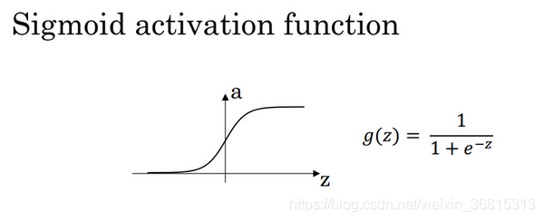

# 神经网络与深度学习

## 1. week1:深度学习概述

### 1.1. 欢迎

### 1.2. 什么是神经网络

就是通过一些特征来计算结果的规则

### 1.3. 用神经网络进行监督学习

它可以作用于结构化数据和非结构化数据，脑机数据就属于非结构化数据，它是类似于图片数据的，所以通常使用CNN

### 1.4. 为什么深度学习会兴起

大量数据才能体现出深度学习的优势，现在收集数据变得简单。深度学习是随着大数据和计算能力的提升而兴起的。

### 1.5. 关于这门课程

### 1.6. 课程资源

### 1.7. 课程总结

## 2. week2:神经网络基础

### 2.1. 二元分类

正向传播：从输入的特征通过网络得到输出结果
反向传播：从输出结果通过网络得到输入的特征

数据的形式：

- 一个图片作为输入数据
  - 图片为RGB三色的，然后每种颜色是n*n(例：64*64)的,那么输入数据 n= $n_x$ =64*64*3
  - 单个图片数据成为了一维数据，输入的数据集合就成了二维数据X=[x1,x2,x3,.....xm]
- 结果0/1表示二分类的结果
  - 那么结果矩阵也就称为了Y=[y1,y2,y3,...ym]

### 2.2. Logistic回归

**前言：** 对于一个二分类问题来说，给定输入X(可能是一张图片)，通过算法进行预测$\hat{y}$，它作为对实际值y的估计。

**预设的函数：**

- $\hat{y} = w^Tx +b$
  - w：逻辑回归的参数，也是一个$n_x$ 维向量(特征权值，维度与特征向量一样)
  - b：偏差

**预设函数的致命缺点：** 目的是让$\hat{y}$在值在[0,1]，但是预设的函数的计算结果明显不符合条件。

***引出Logistic***

将预设函数式作为自变量放到sigmoid函数(激活函数)中，就会得到合适的$\hat{y}$

$\hat{y} = \sigma (w^Tx+b)$
$\sigma (z) = \frac{1}{1+e^{-z}}$

### 2.3. Logistic回归损失函数

**代价函数(cost function)：** 它是为了训练逻辑回归模型的参数w和参数b。

**损失函数(loss function)：** 通过损失函数$L(\hat{y},y)$来预测输出值和真实值的差距，进而衡量算法的运行情况。

损失函数：$L(\hat{y},y) = -(y\log_{}{(\hat{y})} + (1-y)\log_{}{(1-\hat{y})})$

- 优点：
  - 在y=1时，损失函数$L=-\log_{}{(\hat{y})}$，只有$\hat{y}$尽可能小，损失函数才会尽可能小
  - 在y=0时，损失函数$L=-\log_{}{(1 - \hat{y})}$，只有$\hat{y}$尽可能小，损失函数才会尽可能小

**代价函数干什么？** 损失函数是在单个训练样本中定义的，想要衡量算法在全部训练样本上的表现，就需要代价函数了，它是对m个样本的损失函数求平均。

代价函数：$J(w,b) = \frac{1}{m} \sum_{i=1}^{m}L(\hat{y}^{(i)}, y^{(i)}) = \frac{1}{m} \sum_{i=1}^{m}(- y^{(i)} \log_{}{(\hat{y}^{(i)})} - (1-y^{(i)})\log_{}{(1-\hat{y}^{(i)})})$

总代价越低说明w和b越合适。

### 2.4. 梯度下降法

使用梯度下降法来训练或学习训练集上的参数w和b。


- 图中的元素：
  - 横轴表示空间参数w和b
  - 曲面是代价函数$J(w,b)$
- 目的：
  - 找到代价函数最小值时对应的参数w，b
- 过程：
  1. 初始的参数w，b
  2. 朝着使得代价函数最小值的的方向迭代
  3. 走到全局最优解或者接近全局最优解的地方

***梯度下降法的细化细节***

两个参数：

- $w: = w - \alpha \frac{\partial J(w,b)}{\partial w}$
- $b: = b - \alpha \frac{\partial J(w,b)}{\partial b}$

$\alpha$表示学习率，用来控制步长。

### 2.5. 导数

### 2.6. 更多导数例子

### 2.7. 计算图

神经网络的计算都是前向传播或反向传播的。

### 2.8. 计算图的导数计算


使用链式求导法则计算，用于反向传播计算

$\frac{dJ}{du} = \frac{dJ}{dv} \frac{dv}{du}$
$\frac{dJ}{db} = \frac{dJ}{du} \frac{du}{db}$
$\frac{dJ}{da} = \frac{dJ}{du} \frac{du}{da}$

### 2.9. Logistic回归的梯度下降法

通过计算偏导数来实现逻辑回归的梯度下降算法。

几个关键公式：

- $dz = \frac{dL(a,y)}{dz} = \frac{dL}{dz} = (\frac{dL}{dz}) \cdot (\frac{da}{dz}) = (-\frac{y}{a} + \frac{(1-y)}{(1-a)}) \cdot a(1-a) = a-y$
- $dw1 = \frac{\partial L}{\partial w1} = \frac{1}{m} \sum_{i}^{m}x_1^{(i)}(a^{(i)}-y^{(i)})$
- $dw2 = \frac{\partial L}{\partial w2} = \frac{1}{m} \sum_{i}^{m}x_2^{(i)}(a^{(i)}-y^{(i)})$
- $db = dz = \frac{1}{m}\sum_{i}^{m}(a^{(i)}-y^{(i)})$

### 2.10. m个样本的梯度下降

```python
# m个样本特堵下降计算方式
J=0;dw1=0;dw2=0;db=0;
for i = 1 to m
    z(i) = wx(i)+b;
    a(i) = sigmoid(z(i));
    J += -[y(i)log(a(i))+(1-y(i)）log(1-a(i));
    dz(i) = a(i)-y(i);
    dw1 += x1(i)dz(i);
    dw2 += x2(i)dz(i);
    db += dz(i);
J/= m;
dw1/= m;
dw2/= m;
db/= m;
w=w-alpha*dw
b=b-alpha*db
```

这种计算方式的缺点：

- 需要通过for循环遍历所有的特征及m个样本，计算量过于复杂

### 2.11. 向量化

向量化是为了简化for循环计算的复杂性，节约计算时间。

```python
# 非向量化版本
x
z = 0
for i in range(n_x):
  z += w[i] * x[i]
z += b

# 向量化版本
import numpy as np

x
z = 0
z = np.dot(w,x) + b
```

举个例子

```python
# 非向量化
import numpy as np
import time

a = np.arry([1,2,3,4])
a = np.random.rand(1000000)
b = np.random.rand(1000000)
c = 0
tic = time.time()
for i in range(1000000):
  c += a[i] * b[i]
toc = time.time()
print(c)
print("For loop:" + str(1000*(toc-tic)) + "ms")
# 结果为500ms

# 向量化
tic = time.time()
c = np.dot(a,b)
toc = time.time()
print(c)
print("Vectorized version:" + str(1000*(toc-tic)) + "ms")
# 结果为1.5ms
# 使用np.dot()大约实现了300倍的提升
```

### 2.12. 向量化的更多例子

### 2.13. 向量化Logistic回归

***先看逻辑回归的前向传播：***

- 有m个训练样本，对第一个样本进行预测，需要进行以下计算：
  - 计算z，$z^{(1)} = w^Tx^{(1)}+b$
  - 计算激活函数$a^{(1)} = \sigma (z^{(1)})$
  - 计算出第一个样本的预测值y
- 对后续的样本预测同理，如果进行m个赝本的预测，就需要使用for循环
- 那么如果想要简单的进行运算呢？
- 查看数据：
  - X：是一个$n_x$行m列的矩阵
  - $Z = w^T X + [bbb...b] = [w^Tx^{(1)}+b, w^Tx^{(2)}+b, w^Tx^{(3)}+b, ... w^Tx^{(m)}+b]$
  - 转换成python代码就是：$Z = np.dot(w^T, X) + b$
    - 这里b是个1*1的矩阵，但是python能根据情况将它转换为1*m的行向量
  - $A = [a^{(1)}, a^{(2)}, a^{(3)}, ... a^{(m)}] = \sigma (Z)$

### 2.14. 向量化Logistic回归的梯度输出

$dZ = A - Y = [dz^{(1)}, dz^{(2)}, dz^{(3)}, ... dz^{(m)}]$
$dz^{(1)} = a^{(1)} - y^{(1)}, dz^{(2)} = a^{(2)} - y^{(2)}, dz^{(3)} = a^{(3)} - y^{(3)}, ... dz^{(m)} = a^{(m)} - y^{(m)}$

而前面已经计算出了A，通过公式计算出dZ就可

$Z = w^T X + b = np.dot(w.T, x) + b$
$A = \sigma (Z)$
$dZ = A - Y$
$dw = \frac{1}{m} * X * dz^T$
$db = \frac{1}{m} * np.sum(dZ)$
$w := w - \alpha * dw$
$b := b - \alpha * db$

### 2.15. Python中的广播

A/cal.reshape(1,4)

这里就体现了广播机制，使用3*4的矩阵A除以1*4的矩阵cal，需要将cal reshape(重塑)成1*4(虽然本例中cal已经是1*4了，但是在写代码的时候格式并不完全是对应的，所以最好转换一下)

### 2.16. 关于Python Numpy向量的说明

### 2.17. Jupyter/iPython笔记本的快速指南

### 2.18. Logistic损失函数的解释

### 2.19. 总结习题

## 3. week3:浅层神经网络

### 3.1. 神经网络概述


逻辑回归模型

$$
\left.\begin{array}{l}
x \\
w \\
b
\end{array}\right\} \rightarrow z=w^{T} x+b \rightarrow a = \sigma (z) \rightarrow L(a,y)
$$

通过输入特征x，参数w和b就可以计算出z，进而通过激活函数得到损失函数。

而这仅是一个sigmoid单元，可以通过许多的这个单元堆叠起来形成一个神经网络。


首先，计算第一层网络中的各个节点相关的数$z^{[1]}$与$a^{[1]}$

$
\left.\begin{array}{l}
x \\
W^{[1]} \\
b^{[1]}
\end{array}\right\} \rightarrow z^{[1]} =W^{[1]} x+b^{[1]} \rightarrow a^{[1]} = \sigma (z^{[1]})
$

计算$z^{[2]}$和$a^{[2]}$，此时，$a^{[2]}$就是整个神经网络最终的输出，用$\hat y$表示。

$
\left.\begin{array}{l}
a^{[1]} = \sigma (z^{[1]}) \\
W^{[2]} \\
b^{[2]}
\end{array}\right\} \rightarrow z^{[2]} =W^{[2]} a ^{[1]}+b^{[2]} \rightarrow a^{[2]} = \sigma (z^{[2]}) \rightarrow L(a^{[2]},y)
$

反复计算a和z，最后得到最终的输出损失函数。

$
\left.\begin{array}{l}
da^{[1]} = d \sigma (z^{[1]}) \\
dW^{[2]} \\
db^{[2]}
\end{array}\right\} \rightarrow dz^{[2]} =d(W^{[2]} a ^{[1]}+b^{[2]}) \rightarrow da^{[2]} = d\sigma (z^{[2]}) \rightarrow dL(a^{[2]},y)
$

### 3.2. 神经网络表示


对3.1中提过的图进行探讨：

- 输入特征x1,x2,x3，它们被称为神经网络的输入层
- 中间是神经网络的隐藏层
  - 隐藏的含义是它里面的准确值不可被查看
  - 它被称为网络的第一层
- 最后面只有一个节点的输出层，它负责产生预测值

使用$a^{[0]}$来代替输入特征x(a表示激活的意思，它意味着网络中不同层的值会传递到它们后面的层中)

- 输入层将x传递给隐藏层，在这里将输入层的激活值称为$a^{[0]}$
- 隐藏层的激活值称为$a^{[1]}$

在这里，隐藏层是四维的向量，所以：

$
a^{[1]}=\left[\begin{array}{c}
a_{1}^{[1]} \\
a_{2}^{[1]} \\
a_{3}^{[1]} \\
a_{4}^{[1]}
\end{array}\right]
$

最后的输出层将会产生某个数值a，它是一个单独的实数，所以$\hat y$的值将取为$a^{[2]}$

### 3.3. 计算神经网络的输出

***第一层神经网络的计算***

1. 计算$z_1^{[1]} : z_1^{[1]} = w_1^{[1]T} x + b_1^{[1]}$
2. 通过激活函数计算$a_1^{[1]} : a_1^{[1]} = \sigma (z_1^{[1]})$
3. 隐藏层的其它神经元的计算过程与第一个的计算过程一样：
   - $z_2^{[1]} : z_2^{[1]} = w_2^{[1]T} x + b_2^{[1]}, a_2^{[1]} : a_2^{[1]} = \sigma (z_2^{[1]})$  
   - $z_3^{[1]} : z_3^{[1]} = w_3^{[1]T} x + b_3^{[1]}, a_3^{[1]} : a_3^{[1]} = \sigma (z_3^{[1]})$
   - $z_4^{[1]} : z_4^{[1]} = w_4^{[1]T} x + b_4^{[1]}, a_4^{[1]} : a_4^{[1]} = \sigma (z_4^{[1]})$

***向量化计算***

$
z^{[n]} = w^{[n]} x + b^{[n]}
$

$
a^{[n]} = \sigma (z^{[n]})
$

$
a^{[1]}=\left[\begin{array}{c}
a_{1}^{[1]} \\
a_{2}^{[1]} \\
a_{3}^{[1]} \\
a_{4}^{[1]}
\end{array}\right]=\sigma (z^{[1]})
$

$
\left[\begin{array}{c}
z_1^{[1]} \\
z_2^{[1]} \\
z_3^{[1]} \\
z_4^{[1]} \\
\end{array}\right]=
\overbrace{\left[\begin{array}{c}
... W_1^{[1]} ... \\
... W_1^{[1]} ... \\
... W_1^{[1]} ... \\
... W_1^{[1]} ... \\
\end{array}\right]}^{W^{[1]}}*
\overbrace{\left[\begin{array}{c}
x_1 \\
x_2 \\
x_3 \\
\end{array}\right]}^{input}+
\overbrace{\left[\begin{array}{c}
b_1^{[1]} \\
b_2^{[1]} \\
b_3^{[1]} \\
b_4^{[1]} \\
\end{array}\right]}^{b^{[1]}}
$

***第二层神经网络的计算**

$
z^{[2]} = W^{[2]} a^{[2]} + b^{[2]}
$

$
a^{[2]}  =\sigma (z^{[2]})
$

### 3.4. 多个例子中的向量化

***如何向量化多个训练样本，并计算出结果***

通过3.3的公式，重复计算m个训练样本

- 通过训练样本$x^{(1)}$来预测$\hat y^{(1)}$
- 通过训练样本$x^{(2)}$来预测$\hat y^{(2)}$
- ...
- 通过训练样本$x^{(m)}$来预测$\hat y^{(m)}$

用激活函数的表示法就得到了：$a^{[2](1)}, a^{[2](2), a^{[2](3)}, ... a^{[2](m)}}$

***用非向量法计算它预测值的公式：***

$
z^{[1](i)} = W^{[1](i)} x^{(i)} + b^{[1](i)}
$

$
a^{[1](i)} = \sigma (z^{[1](i)})
$

$
z^{[2](i)} = W^{[2](i)} a ^{[1](i)} + b^{[2](i)}
$

$
a^{[2](i) = \sigma (z^{[2](i)})}
$

***向量化计算***

先看它们的数据转换

$
x=\left[\begin{array}{cccc}
\vdots & \vdots & \vdots & \vdots \\
x^{[1]} & x^{[2]} & \cdots & x^{[m]} \\
\vdots & \vdots & \vdots & \vdots \\
\end{array}\right]
$

$
Z^{[1]}=\left[\begin{array}{cccc}
\vdots & \vdots & \vdots & \vdots \\
z^{[1](1)} & z^{[1](2)} & \cdots & z^{[1](m)} \\
\vdots & \vdots & \vdots & \vdots \\
\end{array}\right]
$

$
A^{[1]}=\left[\begin{array}{cccc}
\vdots & \vdots & \vdots & \vdots \\
a^{[1](1)} & a^{[1](2)} & \cdots & a^{[1](m)} \\
\vdots & \vdots & \vdots & \vdots \\
\end{array}\right]
$

$
\left.\begin{array}{c}
z^{[1](i)}=W^{[1](i)} x^{(i)}+b^{(1)} \\
a^{[1](i)}=\sigma\left(z^{[1](i)}\right) \\
z^{[2](i)}=W^{[2](i)} a^{[1](i)}+b^{(2)} \\
a^{[2](i)}=\sigma\left(z^{[2](i)}\right)
\end{array}\right\} \Rightarrow\left\{\begin{array}{c}
A^{[1]}=\sigma\left(z^{[1]}\right) \\
z^{[2]}=W^{[2]} A^{[1]}+b^{[2]} \\
A^{[2]}=\sigma\left(z^{[2]}\right)
\end{array}\right.
$

### 3.5. 向量化实现的解释

$
W^{[1]}x=\left[\begin{array}{c}
\cdots \\
\cdots \\
\cdots \\
\end{array}\right]
\left[\begin{array}{cccc}
\vdots & \vdots & \vdots & \vdots \\
x^{(1)} & x^{(2)} & x^{(3)} & \vdots \\
\vdots & \vdots & \vdots & \vdots \\
\end{array}\right]=
\left[\begin{array}{cccc}
\vdots & \vdots & \vdots & \vdots \\
w^{(1)} x^{(1)} & w^{(1)} x^{(2)} & w^{(1)} x^{(3)} & \vdots \\
\vdots & \vdots & \vdots & \vdots \\
\end{array}\right]=
\left[\begin{array}{cccc}
\vdots & \vdots & \vdots & \vdots \\
z^{[1](1)} & z^{[1](2)} & z^{[1](3)} & \vdots \\
\vdots & \vdots & \vdots & \vdots \\
\end{array}\right]=
Z^{[1]}
$

### 3.6. 激活函数

二分用sigmoid(但是tanh函数优于它，就是sigmoid的一个变型)，其他不知道了就用relu

### 3.7. 为什么需要非线性激活函数

如果每层间不使用不定状态的激活函数，那么无论神经网络有多少层都只是简单的线性组合而已。

### 3.8. 激活函数的导数

求导目的是为了找最小值，它作用于反向传播

***sigmoid***



求导公式：

$
\frac{d}{dz} g(z) = \frac{1}{1+e^{-z}}(1-\frac{1}{1+e^{-z}}) = g(z)(1-g(z))
$

- 当z=10或z=-10，结果约为0
- 当z=0，结果为$\frac{1}{4}$

在神经网络中，a=g(z)

$
{g(z)}' = \frac{d}{dz}g(z) = a(1-a)
$

***Tanh***


$
g(z) = tanh(z)=\frac{e^z-e^{-z}}{e^z+e^{-z}}
$

$
\frac{d}{dz}g(z) = 1-(tanh(z))^2
$

- 当z=10或z=-10，结果为0
- 当z=0，结果为1

在神经网络中，a=g(z)

$
{g(z)}' = \frac{d}{dz}g(z) = 1-a^2
$

***ReLU***


$
g(z) = max(0.001z,z)
$

$
{g(z)}'=
\left\{\begin{array}{ccc}
0.01 & if & z<0 \\
1 & if & z>0 \\
undefined & if & z=0 \\
\end{array}\right.
$

### 3.9. 神经网络的梯度下降法

梯度下降目的是为了找到合适的参数，将损失函数收敛到最小值，它是进行在反向传播中的。

神经网络的成本函数(二分类):

$$
J(W^{[1]}, b^{[1]}, W^{[2]}, b^{[2]}) = \frac{1}{m} \sum_{m}^{i=1}L(\hat y,y)
$$

训练参数需要进行梯度下降，在训练神经网络的时候(随机初始化参数很重要)，每次梯度下降都会计算一下预测值：$\hat y, (i=1,2,3,...,m)$

$
dW^{[1]} = \frac{dJ}{dW^{[1]}},db^{[1]} = \frac{dJ}{db^{[1]}}
$

$
dW^{[2]} = \frac{dJ}{dW^{[2]}},db^{[2]} = \frac{dJ}{db^{[2]}}
$

$
W^{[1]} \Rightarrow W^{[1]} - \alpha dW^{[1]},b^{[1]} \Rightarrow b^{[1]}-\alpha db^{[1]}
$

$
W^{[2]} \Rightarrow W^{[2]} - \alpha dW^{[2]},b^{[2]} \Rightarrow b^{[2]}-\alpha db^{[2]}
$

***正向传播***

$
z^{[1]} = W^{[1]}x+b^{[1]}
$

$
a^{[1]} = \sigma (z^{[1]})
$

$
z^{[2]} = W^{[2]} a^{[1]} + b^{[2]}
$

$
a^{[2]} = g^{[2]}(z^{[2]})=\sigma (z^{[2]})
$

***反向传播***

$
dz^{[2]} = A^{[2]} - Y, Y =\left[\begin{array}{cccc}
y^{[1]} & y^{[2]} & \cdots & y^{[m]} \\
\end{array}\right]
$

$
dW^{[2]} = \frac{1}{m}dz^{[2]}A^{[1]T}
$

$
db^{[2]} = \frac{1}{m}np.sum(dz^{[2]},axis=1,keepdims=True)
$

$
dz^{[1]}=\underbrace{W^{[2]T}dz^{[2]}}_{(n^{[1]},m)}*\underbrace{{g^{[1]}}'}_{\begin{matrix}activation & function & of & hidden & layer\end{matrix}}*\underbrace{(z^{[1]})}_{(n^{[1]},m)}
$

$
dW^{[1]} = \frac{1}{m}dz^{[1]}x^T
$

$
\underbrace{db^{[1]}}_{} = \frac{1}{m}np.sum(dz^{{1}},axis=1,keepdims=True)
$

### 3.10. 只管理解反向传播

### 3.11. 随机初始化

对于一个神经网络，权重随机初始化很重要(不可以初始化为0，这样会导致网络失效)

$$
W^{[1]}=np.random.randn(2,2)*0.01,b^{[1]}=np.zeros((2,1))
$$

w的结果要乘0.01，是为了让w的值尽可能小，进而使得a的值尽可能小，z尽可能的小，使得激活函数在不饱和的位置。

$$
W^{[2]}=np.random.rand(2,2)*0.01,b^{[2]}=0
$$

### 3.12. 总结习题

## 4. week4:深层神经网络

### 4.1. 深层神经网络

### 4.2. 深层网络中的前向传播

就是比之前的层数多了一些

$$
z^{[l]}=w^{[l]}a^{[l-1]}+b^{[l]},a^{[l]}=g^{[l]}(z^{[l]})
$$

- l表示层数

向量化的过程可以写为：

$$
Z^{[l]}=W^{[l]}A^{[l-1]}+b^{[l]},A^{[l]}=g^{[l]}(Z^{[l]}),(A^{[0]}=X)
$$

- $A^{[0]}$就是输入的训练样本

### 4.3. 核对矩阵的维度

### 4.4. 为什么使用深层表示

以人脸识别为例：

- 第一层会检测边缘，这是整个图片中很小的一块
- 第二层会将边缘拼接成眼睛、鼻子、嘴巴等器官
- 第三层会将上层的器官连接起来形成区域
- 最后将它得到最终的脸

当然，这只是为了便于理解才这样描述，真正的识别更加复杂。

它是通过一层层的将信息更加形象，每一块的特征进行区分

### 4.5. 搭建深层神经网络模块


这是很好理解参数更新的图片

- 最上面一行是前向传播
  - 它通过输入特征$a^{[0]}$以及内部的参数$w,b$来得到最终的$\hat y$
  - 它每一步都会将$z^{[l]}$保存在cache中
    - 这里既然有最后的$\hat y$为什么还要保存$z^{[l]}$呢？因为每次都使用激活函数，导致下一步参与的$a^{[l]}$与上一步得到的$z^{[l]}$不一样
- 下面是反向传播
  - 它通过最终的$\hat y$以及cache保存的$z^{[l]}$来得到$dw^{[l]}，db^{[l]}$
  - 再通过$w^{[l]}:=w^{[l]}-\alpha dw^{[l]},b^{[l]}:=b^{[l]}-\alpha db^{[l]}$来更新参数
  - $\alpha$是学习率
- 通过一遍遍的正向传播与反向传播得到最适合的参数

### 4.6. 前向和反向传播

***前向传播***

Input $a^{[l-1]}$ Output $a^{[l]}$,cache($z^{[l]}$)(缓存$w^{[l]},b^{[l]}$的效果也是一样的)

更新的函数：

输入$a^{[0]}$

$
z^{[l]}=w^{[l]}a^{{l-1}}+b^{[l]}
$

$
a^{[l]}=g^{[l]}(z^{[l]})
$

向量化过程：

输入$A^{[0]}$

$
Z^{[l]}=W^{[l]}A^{[l-1]}+b^{[l]}
$

$
A^{[l]}=g^{[l]}(Z^{[l]})
$

***反向传播***

Input $da^{[l]}$ Output $da^{[l-1]},dW^{[l]},db^{[l]}$

更新所需的函数：

$
dz^{[l]}=da^{[l]}{g^{[l]}}'(z^{[l]})
$

$
dW^{[l]}=dz^{[l]}a^{[l-1]}
$

$
db^{[l]}=dz^{[l]}
$

$
da^{[l-1]}=W^{[l]T}dz^{[l]}
$

向量化版本：

$
dZ^{[l]}=dA^{[l]}{g^{[l]}}'(Z^{[l]})
$

$
dW^{[l]}=dZ^{[l]}A^{[l-1]}
$

$
db^{[l]}=\frac{1}{m}np.sum(dz^{[l]},axis=1,keepdims=True)
$

$
dA^{[l-1]}=W^{[l]T}dZ^{[l]}
$

### 4.7. 参数 vs 超参数

什么是超参数呢？

算法中的学习率、梯度下降法循环的数量、隐藏层数目、隐藏层单元数目、激活函数的选择...

这些需要你来设置，并且最后实际上是控制参数W和b的值。

超参数是想得到最优的参数，那么怎么得到最优的超参数呢？调参侠了

### 4.8. 这和大脑有什么关系

### 4.9. 总结习题

## 5. 采访

### Geoffery Hinton

### Pieter Abbeel

### lan Goodfellow
